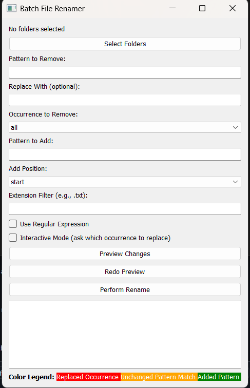
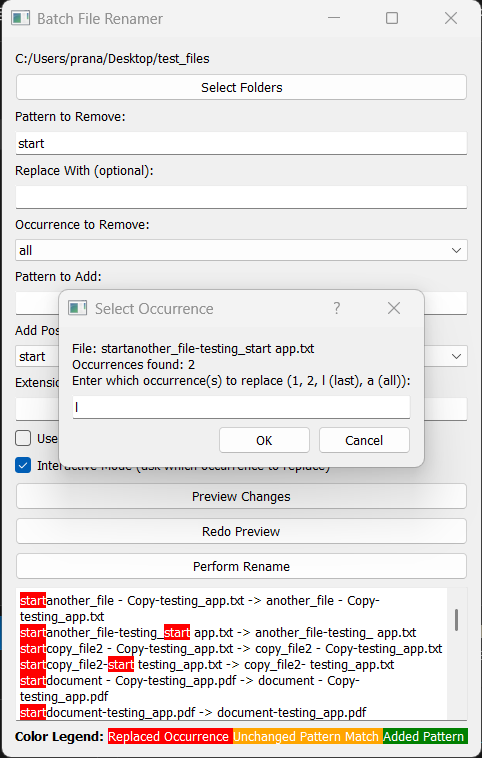
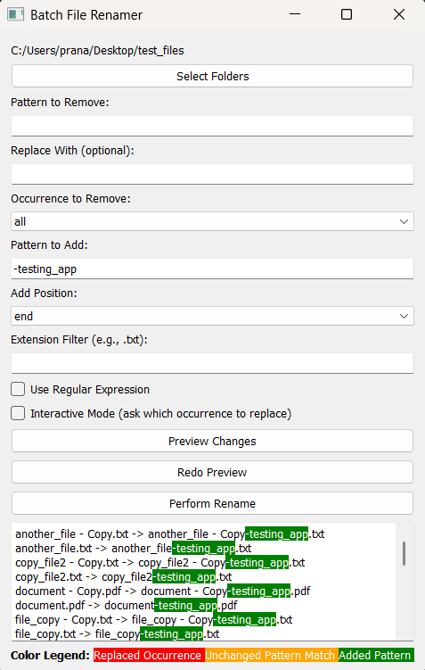
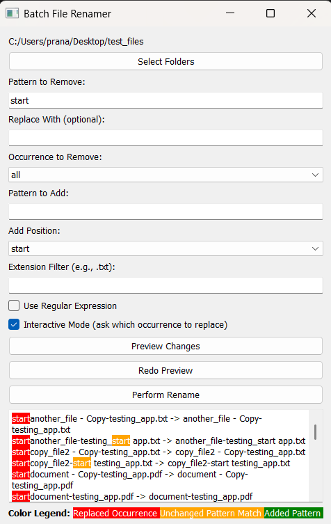
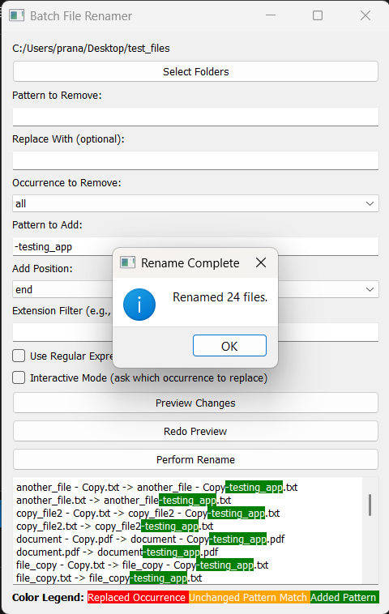

# Batch Renamer (PyQt5)

A powerful and user-friendly batch file renaming tool built with Python and PyQt5.

---

## About the Project

This tool helps you rename multiple files at once using flexible patterns, with features to:

- Remove or replace specific substrings or regex patterns in filenames  
- Selectively replace first, last, all, or specific occurrences  
- Add prefixes or suffixes to filenames  
- Filter files by extension  
- Preview changes with color-coded highlights before renaming  
- Interactive prompts for handling multiple occurrences  
- Error handling and clear rename operations

---

## Why I Built This

Initially, I wanted a simple way to remove patterns like `-123` from filenames or add suffixes like `_edited`. But I ran into challenges:

- Patterns appearing multiple times per filename  
- Users unfamiliar with regular expressions  
- The need for an interactive way to choose which occurrences to replace

After experimenting, I implemented an **interactive mode** that lets users selectively replace occurrences with an easy-to-understand GUI.

---

## Features

- **Selective Replacement:** Choose which occurrence(s) of a pattern to replace  
- **Regular Expressions:** Enable or disable regex matching  
- **Extension Filtering:** Rename only files with specified extensions (e.g., `.txt`)  
- **Interactive Mode:** Prompts for user input when multiple matches are found  
- **Preview with Highlights:**  
  - 🔴 Red = replaced text  
  - 🟠 Orange = matched but unchanged  
  - 🟢 Green = added text (prefix/suffix)  
- **Error Handling:** Informs users if a rename fails  
- **PyQt5 GUI:** Smooth interface with improved color support compared to Tkinter

---

## How It Works

1. Select the folder containing files to rename  
2. Enter the pattern to remove or replace  
3. Optionally specify replacement text and occurrence (first, last, all)  
4. Add a prefix or suffix if desired  
5. Filter files by extension if needed  
6. Preview changes with color highlights  
7. Use interactive prompts to select specific occurrences when multiple matches occur  
8. Confirm and perform rename operation

---

## Screenshots

  
*Batch Renamer GUI with folder selection and pattern inputs*

 


*Preview showing highlighted replacements and additions*


*Preview showing task completed*

---

## Packaging & Usage

Great! Here’s a neat README section you can add to explain how to build the `.exe` and how users can download your pre-built executables from the GitHub Releases page:

---

### Building the Executable (.exe) Using PyInstaller

If you want to create the executable file yourself, follow these steps:

1. **Install PyInstaller** (if you haven't already):

   ```bash
   pip install pyinstaller
   ```

2. **Navigate to the project directory** containing `batch_renamer.py`:

   ```bash
   cd path/to/batch-renamer
   ```

3. **Build a single executable** (all-in-one `.exe`):

   ```bash
   pyinstaller --onefile --name batch_renamer_single batch_renamer.py
   ```

4. **Build a folder-based executable** (creates a folder with dependencies):

   ```bash
   pyinstaller --onedir --name batch_renamer_folder batch_renamer.py
   ```

5. The generated executable(s) will be located in the `dist` folder created by PyInstaller.

---

### Download Pre-built Executables

You can download the ready-to-use executable files from the **Releases** section of this repository:

* **batch\_renamer\_single.exe** — A standalone executable that can be run by double-clicking.
* **batch\_renamer\_folder** — A folder containing the executable along with all required dependencies.

## Future Plans

* Support for PySide6 GUI framework
* Advanced rename templates and presets
* Undo functionality for batch renames
* Multi-folder batch renaming

---

## Code Overview

The core rename logic is in the `rename_files` function, supporting:

* Pattern removal and replacement (regex or plain text)
* Selective occurrence handling
* Interactive user input for multiple matches
* Addition of prefixes/suffixes
* Extension filtering
* Dry-run preview and actual renaming with error handling

The PyQt5 GUI handles user interaction, previews, and triggers renaming.

---

## License

This project is licensed under the MIT License. See [LICENSE.txt](LICENSE.txt) for details.

---

## Acknowledgments

Thanks to the open-source Python community and PyQt5 for making GUI development enjoyable.

---

Feel free to open issues or contribute!

---

